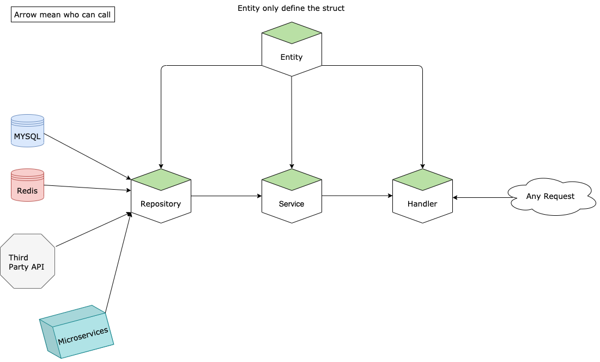

# Skeleton Go Service

# Table of Contents

- [Usage](#usage)
  - [Requirements](#requirements)
  - [Concept-Diagram](#concept-diagram)
    - [Folder struct define](#folder)
    - [Routes](#routes)
    - [Handler](#handler)
    - [Service](#service)
    - [Repositories](#repositories)
    - [Parameter](#parameter)
    - [Validation](#validation)
    - [Global Constants or Stand Alone Struct](#global-constants-or-stand-alone-struct)
    - [Development Tools](#development-tools)

## Usage

### Requirements

- Golang:1.23.0
- PostgreSQL
- [Gin](https://github.com/gin-gonic/gin/tree/v1.7.2)
- [Gorm](https://github.com/go-gorm/gorm/tree/v1.21.11)
- [Godotenv](https://github.com/joho/godotenv/v1.3.0)
- [Validator](https://github.com/go-playground/validator)

[//]: # (- [Delve]&#40;https://github.com/go-delve/delve&#41; Debug swiss knife)

## Concept-Diagram



## Code Convention

### Folder

- cmd: include applications/microservices/tool/worker
- config: global setting
- pkg: reuse module
  - clients: third party connection
  - utils: some tools
- internal: apps implementation
  - middlewares: web application middlewares
  - services: apps business logic
  - repositories: data access or call some third party services
  - models: define the struct like table column, redis data struct, convenience data struct etc.
  - transformers: output data format to client
  - utils: utility functions to apps
  - lang: i18n translations
- Naming convention
  - Non-prefix code related to apps API or common

### Routes

**DO NOT** Combine 3 route with same first character with wild card route

For example

- /asd/:unique_id
- /asd/detail -> first character "d"
- /asd/discard -> first character "d"

Effect

- /asd/d -> will result 404 path not found
- /asd/d12121 -> will result 404 path not found
- /asd/di -> will result 404 path not found
- /asd/d1234-asdasd-221231-asdqweqwe -> will result 404 path not found

For more information, please see [Gin-Gonic Issue#205](https://github.com/gin-gonic/gin/issues/205)

### Handler

- filename.go = handler method
  - one file name related to one handler method
  - Format `[prefix]_[method]_[function-name]`

### Service

- index.go
  - Contract / interface
- service.go
  - Common or Apps API implementation
- payload.go
  - header, JSON Body, query parameter from incoming request
- transformer.go
  - transform response

### Repositories

- index.go
  - Contract / interface
- repo.go
  - Common or Apps Repositories implementation
- struct.go
  - Custom model to retrieve from query

### Validation

- HTTP Request validator
  - [Gin Validator](https://github.com/go-playground/validator)
  - Custom Validator
    - `pkg/utils/validator/custom_validator.go`

### Go Routine

**Do not** directly use Go Routine as it had possibility unhandled panic. Use `syncs.GoRecover` to handle panic and sent log to mongo (if system mode `release`).


## Translation

- How to add translation
  - Add or create function here based on required translation

    **Golang Validation**
    - `validator_translation.go`
      - Add golang filter translation

    **Custom Validation**
    - `custom_validator.go`
      - Create custom function validation

  - Add string code and translation here
    - en-US.json *English Translation*
    - id.json *Indonesian Translation*

    **Use ERR_{$field} for validation error prefix**

  - You can use field name or params (opt)

  **Example**
  ```
  failedField := e.Field()
		params := e.Param()
		templateData := map[string]interface{}{"Field": failedField, "Length": params}
		msg, _ := lang.CurrentTranslation.Translate("ERR_LEN", templateData)
		return msg
  ```


## Development Tools

- vscode format/lint setting

```json
  "go.formatTool": "goimports",
"go.lintOnSave": "file",
"go.lintTool": "golangci-lint",
"go.lintFlags": [
"--fast",
"--exclude-use-default=false",
"--print-issued-lines=false",
"-Egolint",
"-Egoimports",
"--exclude-use-default=false"
],
```

- [Golang Air live reload / hot deploy](https://github.com/cosmtrek/air)
